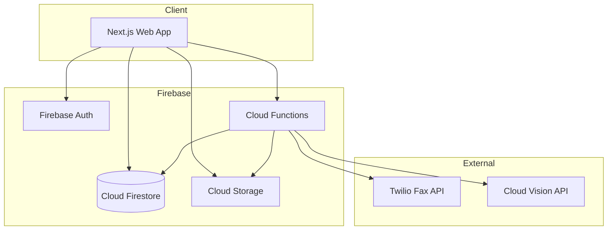

# 軽量Firebase中心アーキテクチャ提案

## 概要

従来のSupabase + Next.js + 複雑なテンプレート機能から、**Firebase中心の軽量構成**に移行することで、素早く安定した動作を実現します。

## 設計方針

1. **軽量性の追求**: 最小限の依存関係、シンプルな構成
2. **安定性優先**: 実績のあるFirebaseサービスを活用
3. **段階的実装**: 小さい粒度で機能を追加
4. **テンプレート機能削除**: 複雑なテンプレート機能は実装しない
5. **テスト削減**: E2Eテストは最小限、単体テストにフォーカス

## 技術スタック（簡素化版）

### フロントエンド
- **Next.js 14** (App Router)
- **TypeScript**
- **Tailwind CSS** (最小限のスタイリング)
- **基本的なReactコンポーネント** (shadcn/uiは必要最小限のみ)

### バックエンド（Firebase中心）
- **Firebase Authentication** - 認証
- **Cloud Firestore** - NoSQLデータベース
- **Cloud Storage** - ファイル保存
- **Cloud Functions** - サーバーレス処理
- **Firebase Hosting** - 静的ファイルホスティング

### 外部サービス（最小限）
- **FAX API**: Twilio Fax API（送受信）
- **OCR**: Google Cloud Vision API（Firebaseと統合容易）

### 削除する要素
- ❌ Supabase（Firebaseに統合）
- ❌ Prisma（FirestoreのSDKで十分）
- ❌ tRPC（シンプルなAPI Routesで十分）
- ❌ テンプレート機能（複雑すぎる）
- ❌ 物件情報連携（将来の拡張に）
- ❌ 顧客管理連携（将来の拡張に）
- ❌ 包括的なE2Eテスト（最小限のみ）

## アーキテクチャ図



## データモデル（簡素化版）

### Firestoreコレクション

#### users
```typescript
{
  uid: string,              // Firebase Auth UID
  email: string,
  displayName: string,
  createdAt: Timestamp,
  updatedAt: Timestamp
}
```

#### sentFaxes
```typescript
{
  id: string,
  userId: string,
  faxNumber: string,
  fileName: string,
  fileUrl: string,          // Cloud Storage URL
  status: 'pending' | 'sent' | 'failed',
  propertyName?: string,
  viewingDate?: string,
  viewingTime?: string,
  agentName?: string,
  ocrData?: {
    managementCompany?: string,
    extractedFaxNumber?: string,
    rawText?: string
  },
  sentAt?: Timestamp,
  errorMessage?: string,
  createdAt: Timestamp
}
```

#### receivedFaxes
```typescript
{
  id: string,
  userId: string,
  fromFaxNumber: string,
  fileName: string,
  fileUrl: string,          // Cloud Storage URL
  ocrText?: string,
  receivedAt: Timestamp,
  createdAt: Timestamp
}
```

#### addressBook
```typescript
{
  id: string,
  userId: string,
  name: string,             // 管理会社名
  faxNumber: string,
  notes?: string,
  createdAt: Timestamp,
  updatedAt: Timestamp
}
```

## コア機能（最小限）

### Phase 1: MVP（最優先）
1. **認証**
   - Firebase Authentication（メール/パスワード）
   - ログイン/登録/ログアウト
   
2. **FAX送信（基本）**
   - PDFアップロード
   - 宛先FAX番号入力
   - Twilio経由で送信
   - 送信履歴保存

3. **FAX受信（基本）**
   - Twilioからのwebhook受信
   - 受信FAX保存
   - 受信一覧表示

4. **履歴管理**
   - 送信履歴一覧
   - 受信履歴一覧
   - 基本的な検索

### Phase 2: 機能拡張
1. **OCR統合**
   - アップロードファイルからOCR抽出
   - 管理会社名/FAX番号の自動入力

2. **アドレス帳**
   - 連絡先の登録/編集/削除
   - FAX送信時に選択可能

3. **内見申請ワークフロー**
   - 内見日時入力
   - 担当者名入力
   - シンプルなPDF生成

### 削除される機能
- ❌ テンプレート機能（複雑すぎる）
- ❌ 物件情報連携
- ❌ 顧客管理連携
- ❌ 一括送信（後から追加可能）
- ❌ AI推論機能（後から追加可能）

## API設計（簡素化版）

### Next.js API Routes

#### 認証（Firebase SDKで処理）
- クライアント側でFirebase Auth SDKを直接使用

#### FAX送信
- `POST /api/fax/send` - FAX送信
- `POST /api/fax/upload` - ファイルアップロード
- `GET /api/fax/sent` - 送信履歴取得

#### FAX受信
- `POST /api/fax/webhook` - Twilio webhook
- `GET /api/fax/received` - 受信履歴取得

#### アドレス帳
- `GET /api/address-book` - 一覧取得
- `POST /api/address-book` - 追加
- `PUT /api/address-book/[id]` - 更新
- `DELETE /api/address-book/[id]` - 削除

#### OCR
- `POST /api/ocr/extract` - OCR処理

## Cloud Functions（サーバーレス処理）

```typescript
// functions/src/index.ts
import * as functions from 'firebase-functions';
import * as admin from 'firebase-admin';

// FAX送信処理
export const sendFax = functions.https.onCall(async (data, context) => {
  // Twilio API呼び出し
  // Firestoreに結果保存
});

// FAX受信webhook
export const receiveFaxWebhook = functions.https.onRequest(async (req, res) => {
  // Twilioから受信
  // Cloud Storageに保存
  // Firestoreに記録
});

// OCR処理
export const processOCR = functions.storage.object().onFinalize(async (object) => {
  // Cloud Vision API呼び出し
  // 結果をFirestoreに保存
});
```

## ディレクトリ構造

```
dentee-eeFax/
├── .firebaserc
├── firebase.json
├── firestore.rules
├── firestore.indexes.json
├── storage.rules
├── package.json
├── tsconfig.json
├── next.config.js
├── tailwind.config.js
├── .env.local.example
├── README.md
├── ARCHITECTURE.md
│
├── src/
│   ├── app/
│   │   ├── layout.tsx
│   │   ├── page.tsx
│   │   ├── login/
│   │   │   └── page.tsx
│   │   ├── dashboard/
│   │   │   └── page.tsx
│   │   ├── fax/
│   │   │   ├── send/
│   │   │   │   └── page.tsx
│   │   │   ├── received/
│   │   │   │   └── page.tsx
│   │   │   └── history/
│   │   │       └── page.tsx
│   │   ├── address-book/
│   │   │   └── page.tsx
│   │   └── api/
│   │       ├── fax/
│   │       │   ├── send/
│   │       │   │   └── route.ts
│   │       │   ├── upload/
│   │       │   │   └── route.ts
│   │       │   └── webhook/
│   │       │       └── route.ts
│   │       ├── address-book/
│   │       │   └── route.ts
│   │       └── ocr/
│   │           └── extract/
│   │               └── route.ts
│   │
│   ├── components/
│   │   ├── layout/
│   │   │   ├── Header.tsx
│   │   │   └── Sidebar.tsx
│   │   ├── fax/
│   │   │   ├── FaxUploadForm.tsx
│   │   │   ├── FaxHistoryList.tsx
│   │   │   └── FaxDetailView.tsx
│   │   └── ui/
│   │       ├── Button.tsx
│   │       ├── Input.tsx
│   │       └── Card.tsx
│   │
│   ├── lib/
│   │   ├── firebase/
│   │   │   ├── config.ts
│   │   │   ├── auth.ts
│   │   │   ├── firestore.ts
│   │   │   └── storage.ts
│   │   ├── twilio/
│   │   │   └── client.ts
│   │   └── utils/
│   │       └── helpers.ts
│   │
│   └── types/
│       ├── fax.ts
│       └── user.ts
│
├── functions/
│   ├── package.json
│   ├── tsconfig.json
│   └── src/
│       ├── index.ts
│       ├── fax/
│       │   ├── send.ts
│       │   └── receive.ts
│       └── ocr/
│           └── process.ts
│
└── public/
    └── (静的ファイル)
```

## セキュリティルール

### Firestore Rules
```javascript
rules_version = '2';
service cloud.firestore {
  match /databases/{database}/documents {
    // ユーザーは自分のデータのみアクセス可能
    match /sentFaxes/{faxId} {
      allow read, write: if request.auth != null && request.auth.uid == resource.data.userId;
    }
    
    match /receivedFaxes/{faxId} {
      allow read, write: if request.auth != null && request.auth.uid == resource.data.userId;
    }
    
    match /addressBook/{contactId} {
      allow read, write: if request.auth != null && request.auth.uid == resource.data.userId;
    }
  }
}
```

### Storage Rules
```javascript
rules_version = '2';
service firebase.storage {
  match /b/{bucket}/o {
    match /users/{userId}/{allPaths=**} {
      allow read, write: if request.auth != null && request.auth.uid == userId;
    }
  }
}
```

## 開発ステップ

### Step 1: 初期セットアップ（1日）
- [ ] Firebaseプロジェクト作成
- [ ] Next.jsプロジェクト初期化
- [ ] Firebase SDK設定
- [ ] 基本的なレイアウト作成

### Step 2: 認証実装（1日）
- [ ] Firebase Authentication設定
- [ ] ログイン/登録ページ作成
- [ ] 認証状態管理

### Step 3: FAX送信基本機能（2日）
- [ ] ファイルアップロード実装
- [ ] Twilio統合
- [ ] 送信API実装
- [ ] 送信履歴表示

### Step 4: FAX受信基本機能（2日）
- [ ] Webhook実装
- [ ] 受信FAX保存
- [ ] 受信履歴表示

### Step 5: アドレス帳（1日）
- [ ] CRUD API実装
- [ ] UI実装

### Step 6: OCR統合（1日）
- [ ] Cloud Vision API設定
- [ ] OCR処理実装
- [ ] 自動入力機能

### Step 7: 内見申請ワークフロー（2日）
- [ ] 内見情報入力フォーム
- [ ] シンプルなPDF生成
- [ ] 統合テスト

## テスト戦略（簡素化版）

### 実装するテスト
- ✅ 単体テスト（Vitest）- 重要な関数のみ
- ✅ 統合テスト（API Routes）- 主要エンドポイント
- ✅ 最小限のE2Eテスト（Playwright）- 送信/受信の基本フロー

### 削減するテスト
- ❌ 包括的なE2Eテスト
- ❌ UI単体テスト（すべて）
- ❌ パフォーマンステスト

### テストファイル構成
```
tests/
├── unit/
│   ├── lib/
│   │   └── utils.test.ts
│   └── api/
│       └── fax.test.ts
├── integration/
│   └── api/
│       ├── send-fax.test.ts
│       └── receive-fax.test.ts
└── e2e/
    ├── auth.spec.ts
    └── send-fax.spec.ts
```

## デプロイ

```bash
# Firebaseへデプロイ
firebase deploy --only hosting,functions,firestore,storage

# または個別に
firebase deploy --only hosting
firebase deploy --only functions
```

## 環境変数

```env
# .env.local
NEXT_PUBLIC_FIREBASE_API_KEY=
NEXT_PUBLIC_FIREBASE_AUTH_DOMAIN=
NEXT_PUBLIC_FIREBASE_PROJECT_ID=
NEXT_PUBLIC_FIREBASE_STORAGE_BUCKET=
NEXT_PUBLIC_FIREBASE_MESSAGING_SENDER_ID=
NEXT_PUBLIC_FIREBASE_APP_ID=

TWILIO_ACCOUNT_SID=
TWILIO_AUTH_TOKEN=
TWILIO_FAX_NUMBER=

GOOGLE_CLOUD_PROJECT_ID=
GOOGLE_CLOUD_VISION_API_KEY=
```

## メリット

1. **素早い実装**: Firebaseの既存機能を活用
2. **低コスト**: サーバーレスで従量課金
3. **スケーラブル**: Firebaseの自動スケーリング
4. **安定性**: Googleの実績あるインフラ
5. **シンプル**: 最小限の依存関係
6. **保守性**: 小さいコードベース

## 次のステップ

1. Firebaseプロジェクトの作成
2. 基本的なNext.jsアプリのセットアップ
3. 認証機能の実装
4. FAX送信の基本機能実装
5. 段階的に機能追加
