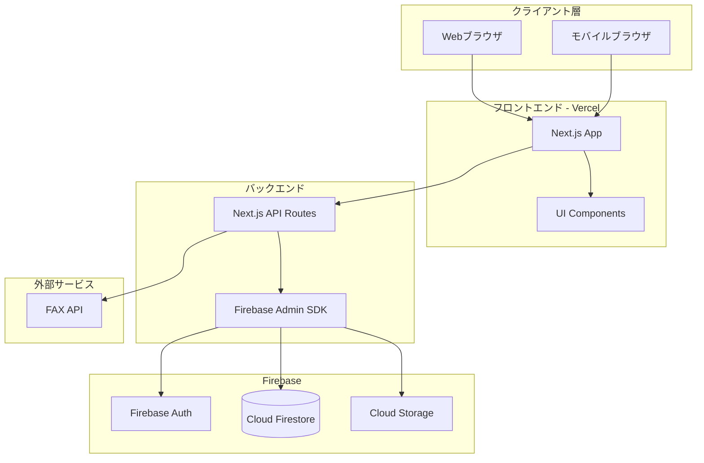
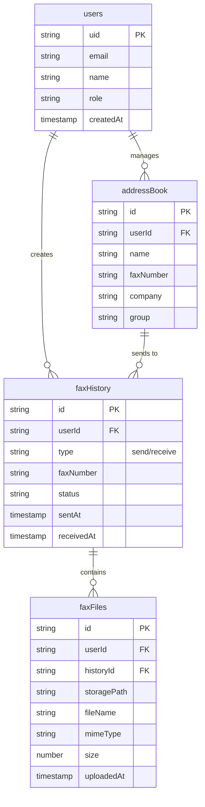

#不動産業界向けインターネットFAXアプリケーション 仕様書

## 1. プロジェクト概要

### 1.1 目的

不動産業界に特化したインターネットFAXサービスを提供し、効率的なFAX送受信を実現する。Firebase中心の軽量構成により、迅速な開発と安定した動作を実現。

### 1.2 対象ユーザー

- 不動産会社の営業担当者
- 事務スタッフ
- 管理部門スタッフ

### 1.3 対応デバイス

- PC（Windows, macOS, Linux）
- スマートフォン（iOS, Android）
- タブレット（iOS, Android）

## 2. システムアーキテクチャ

### 2.1 技術スタック（Firebase中心の軽量構成）

- **フロントエンド**: Next.js 14+ (App Router), React, TypeScript
- **UIフレームワーク**: Tailwind CSS, shadcn/ui
- **バックエンド**: Next.js API Routes + Firebase Admin SDK
- **データベース**: Cloud Firestore（NoSQL、リアルタイム同期対応）
- **認証**: Firebase Authentication（メール/パスワード認証）
- **ファイルストレージ**: Cloud Storage for Firebase
- **FAXサービス**: 外部FAX API（Twilio Fax API または類似サービス）
- **ホスティング**: Vercel（フロントエンド） + Firebase Functions（オプション）

### 2.2 システム構成図（Firebase中心）




## 3. 機能要件

### 3.1 認証・認可機能

- Firebase Authenticationによるユーザー登録・ログイン
- パスワードリセット（Firebase提供機能）
- セッション管理（Firebase提供機能）
- 基本的なロールベースアクセス制御（Firestoreカスタムクレーム）

### 3.2 FAX送信機能

- **基本送信**
  - ファイルアップロード（PDF, 画像形式）
  - 宛先FAX番号入力
  - 送信者情報設定
  - 送信確認・プレビュー
- **送信オプション**
  - 送信結果通知（メール）
  - 再送機能

### 3.3 FAX受信機能

- 自動受信・Cloud Storage保存
- 受信FAX一覧表示
- 受信FAXのプレビュー
- 受信FAXのダウンロード
- 受信通知（メール）

### 3.4 送受信履歴管理

- 送信履歴一覧（日付、宛先、ステータス）
- 受信履歴一覧
- 基本的な検索・フィルタ機能（日付範囲、宛先）
- 詳細情報表示（送信時刻、完了時刻、エラー情報）

### 3.5 アドレス帳管理

- 連絡先の登録・編集・削除
- グループ管理（顧客グループ、取引先グループなど）
- 基本的な検索機能
- カスタムフィールド（会社名、部署）

### 3.6 ファイル管理機能

- 送信ファイルのアップロード・保存（Cloud Storage）
- 受信FAXの保存・整理
- ファイル検索
- ファイル削除（論理削除）

## 4. 非機能要件

### 4.1 パフォーマンス

- ページ読み込み時間: 3秒以内
- FAX送信処理: 10秒以内にキューイング完了
- 同時接続数: 100ユーザー以上

### 4.2 セキュリティ

- HTTPS通信必須
- データ暗号化（保存時・転送時）
- アクセスログ記録
- 定期的なセキュリティ監査
- 個人情報保護法対応

### 4.3 可用性

- 稼働率: 99.5%以上
- バックアップ: 日次自動バックアップ
- 災害復旧計画

### 4.4 ユーザビリティ

- レスポンシブデザイン（モバイルファースト）
- 直感的なUI/UX
- アクセシビリティ対応（WCAG 2.1 AA準拠）
- 多言語対応（日本語、英語）

### 4.5 スケーラビリティ

- 水平スケーリング対応
- クラウドインフラ対応
- 負荷分散対応

## 5. データモデル（Firestore）

### 5.1 主要コレクション



### 5.2 Firestoreコレクション構造

```
/users/{userId}
  - email: string
  - name: string
  - role: string
  - createdAt: timestamp

/faxHistory/{historyId}
  - userId: string
  - type: string (send | receive)
  - faxNumber: string
  - toName: string (optional)
  - fromName: string (optional)
  - status: string (pending | sent | failed | received)
  - fileId: string
  - sentAt: timestamp
  - receivedAt: timestamp
  - errorMessage: string (optional)
  - createdAt: timestamp

/addressBook/{contactId}
  - userId: string
  - name: string
  - faxNumber: string
  - company: string
  - group: string
  - notes: string
  - createdAt: timestamp
  - updatedAt: timestamp

/faxFiles/{fileId}
  - userId: string
  - historyId: string
  - storagePath: string (Cloud Storage path)
  - fileName: string
  - mimeType: string
  - size: number
  - uploadedAt: timestamp
```


## 6. API設計

### 6.1 主要エンドポイント

#### 認証（Firebase Authentication）

- `POST /api/auth/register` - ユーザー登録（Firebase経由）
- `POST /api/auth/login` - ログイン（Firebase経由）
- `POST /api/auth/logout` - ログアウト

#### FAX送信

- `POST /api/fax/send` - FAX送信
- `GET /api/fax/status/:id` - 送信ステータス確認

#### FAX受信

- `POST /api/fax/webhook` - FAX受信Webhook
- `GET /api/fax/received` - 受信FAX一覧
- `GET /api/fax/received/:id` - 受信FAX詳細
- `GET /api/fax/received/:id/download` - 受信FAXダウンロード

#### 履歴

- `GET /api/fax/history` - 送受信履歴一覧
- `GET /api/fax/history/:id` - 履歴詳細

#### アドレス帳

- `GET /api/address-book` - アドレス帳一覧
- `POST /api/address-book` - 連絡先追加
- `PUT /api/address-book/:id` - 連絡先更新
- `DELETE /api/address-book/:id` - 連絡先削除

#### ファイル管理

- `POST /api/files/upload` - ファイルアップロード
- `GET /api/files/:id` - ファイル取得
- `DELETE /api/files/:id` - ファイル削除

## 7. UI/UX設計

### 7.1 主要画面構成（簡素化）

1. **ダッシュボード**
   - 送受信統計
   - 最近のFAX履歴
   - クイックアクション

2. **FAX送信画面**
   - ファイルアップロードエリア
   - 宛先選択（アドレス帳/手入力）
   - プレビュー表示

3. **FAX受信画面**
   - 受信FAX一覧（リスト表示）
   - 基本的なフィルタ機能
   - プレビュー・ダウンロード

4. **履歴画面**
   - 送受信履歴一覧
   - 基本的な検索機能

5. **アドレス帳画面**
   - 連絡先一覧
   - グループ管理

6. **設定画面**
   - プロフィール設定
   - 通知設定

### 7.2 レスポンシブデザイン

- モバイル: 1カラムレイアウト、タッチ操作最適化
- タブレット: 2カラムレイアウト
- PC: 2-3カラムレイアウト

## 8. 開発フェーズ（小規模インクリメンタル）

### Phase 1: 基盤構築（1-2週間）

- Next.jsプロジェクトセットアップ
- Firebase初期化（Auth、Firestore、Storage）
- 基本的な認証機能（ログイン・登録）

### Phase 2: コア機能実装（2-3週間）

- ファイルアップロード機能（Cloud Storage）
- FAX送信機能（外部API連携）
- FAX受信機能（Webhook、自動保存）
- 基本的なUI実装

### Phase 3: 管理機能（1-2週間）

- 送受信履歴管理
- アドレス帳機能
- 基本的な検索・フィルタ

### Phase 4: 改善・安定化（1週間）

- パフォーマンス最適化
- エラーハンドリング強化
- 単体テストの追加（主要機能のみ）
- ユーザビリティ改善

## 9. セキュリティ考慮事項

- Firebase Security Rulesによるデータアクセス制御
- 入力値検証・サニタイゼーション
- HTTPS通信（Firebase、Vercel標準）
- ファイルアップロード検証（サイズ、形式）
- レート制限（Firebase App Check）

## 10. テスト戦略（軽量化）

- 単体テスト（Jest）- 主要なビジネスロジックのみ
- 統合テスト - API エンドポイントの主要フロー
- 手動テスト - UI/UXの基本動作確認
- **注**: E2Eテストは初期段階では実装せず、手動テストで代替

## 11. Firebase利用のメリット

### 11.1 開発速度の向上
- 認証機能が組み込み済み（メール/パスワード、SNS連携も容易）
- データベース設計が柔軟（NoSQL）
- ファイルストレージが統合済み
- リアルタイム同期が標準機能

### 11.2 運用コストの削減
- インフラ管理不要（フルマネージド）
- 自動スケーリング
- 無料枠が充実
- 従量課金で初期コスト低減

### 11.3 安定性とセキュリティ
- Googleのインフラ基盤
- 自動バックアップ
- セキュリティルールによる細かいアクセス制御
- DDoS対策が標準装備

## 12. 実装における注意点

### 12.1 Firebase制約への対応
- Firestoreの書き込み制限（1秒に1回/ドキュメント）に注意
- 複雑なクエリは制限されるため、データモデル設計を工夫
- Cloud Storageのファイルサイズ制限（最大5TB）

### 12.2 コスト管理
- Firestore読み書き回数の最適化
- Cloud Storage転送量の監視
- Firebase使用量ダッシュボードで定期確認

### 12.3 移行性の確保
- ビジネスロジックはNext.js側に集約
- Firebase依存部分を抽象化（将来的な移行に備える）