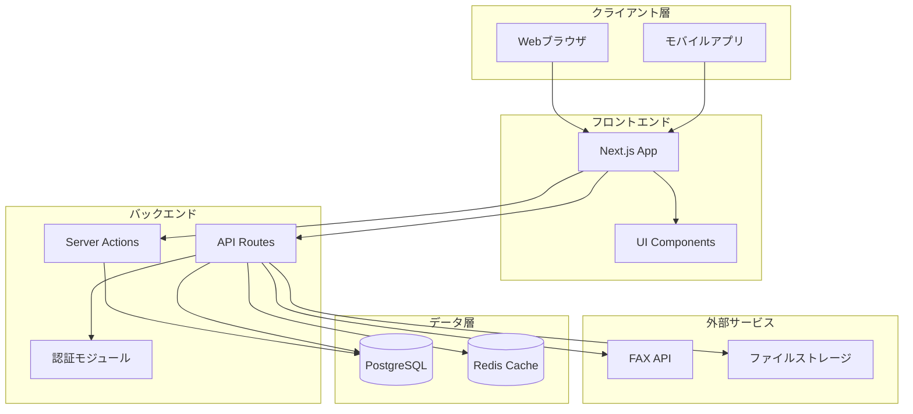
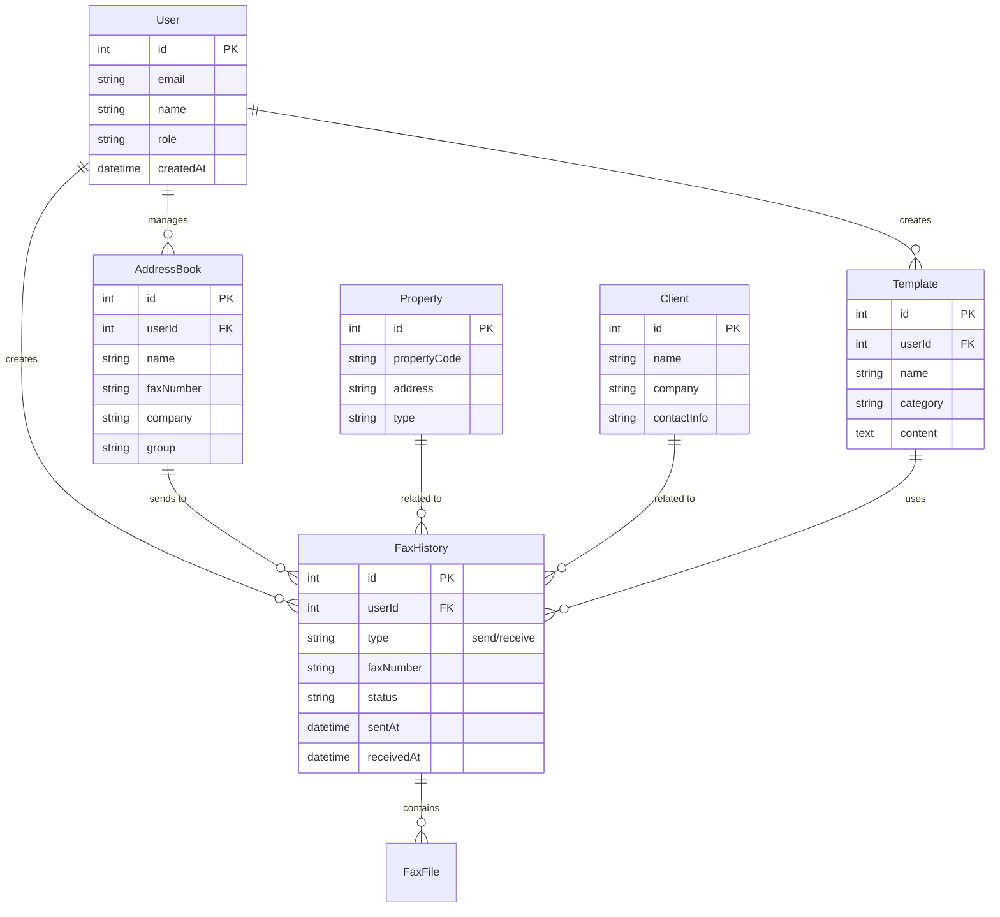

#不動産業界向けインターネットFAXアプリケーション 仕様書

## 1. プロジェクト概要

### 1.1 目的

不動産業界に特化したインターネットFAXサービスを提供し、物件情報や顧客情報と連携した効率的なFAX送受信を実現する。

### 1.2 対象ユーザー

- 不動産会社の営業担当者
- 事務スタッフ
- 管理部門スタッフ

### 1.3 対応デバイス

- PC（Windows, macOS, Linux）
- スマートフォン（iOS, Android）
- タブレット（iOS, Android）

## 2. システムアーキテクチャ

### 2.1 技術スタック

- **フロントエンド**: Next.js 14+ (App Router), React, TypeScript
- **UIフレームワーク**: Tailwind CSS, shadcn/ui
- **バックエンド**: Next.js API Routes / Server Actions
- **データベース**: PostgreSQL（推奨）または MySQL
- **認証**: NextAuth.js
- **FAXサービス**: 外部FAX API（Twilio Fax API または類似サービス）
- **ファイルストレージ**: AWS S3 / Azure Blob Storage / ローカルストレージ
- **リアルタイム通信**: WebSocket（Socket.io）または Server-Sent Events

### 2.2 システム構成図

## 3. 機能要件

### 3.1 認証・認可機能

- ユーザー登録・ログイン
- パスワードリセット
- セッション管理
- ロールベースアクセス制御（管理者、一般ユーザー）
- 多要素認証（オプション）

### 3.2 FAX送信機能

- **基本送信**
- ファイルアップロード（PDF, 画像形式）
- 宛先FAX番号入力
- 送信者情報設定
- 送信スケジュール設定
- 送信確認・プレビュー
- **一括送信**
- CSV/Excelからの宛先一括インポート
- テンプレートと宛先の組み合わせ送信
- 送信進捗表示
- **送信オプション**
- 送信優先度設定
- 送信結果通知（メール/SMS）
- 再送機能

### 3.3 FAX受信機能

- 自動受信・保存
- 受信FAX一覧表示
- 受信FAXのプレビュー
- 受信FAXのダウンロード
- 受信通知（メール/プッシュ通知）
- OCR機能（テキスト抽出、オプション）

### 3.4 送受信履歴管理

- 送信履歴一覧（日付、宛先、ステータス、件名）
- 受信履歴一覧
- 検索・フィルタ機能（日付範囲、宛先、キーワード）
- 履歴のエクスポート（CSV/Excel）
- 詳細情報表示（送信時刻、完了時刻、エラー情報）

### 3.5 アドレス帳管理

- 連絡先の登録・編集・削除
- グループ管理（顧客グループ、取引先グループなど）
- CSV/Excelからの一括インポート
- 検索機能
- カスタムフィールド（会社名、部署、役職など）

### 3.6 テンプレート機能

- テンプレート作成・編集・削除
- テンプレートカテゴリ管理
- 変数挿入機能（日付、会社名、物件名など）
- テンプレートプレビュー
- テンプレート共有（組織内）

### 3.7 物件情報連携機能

- 物件情報の表示・検索
- FAX送信時に物件情報を自動挿入
- 物件に関連するFAX履歴の表示
- 物件情報から直接FAX送信

### 3.8 顧客管理連携機能

- 顧客情報の表示・検索
- 顧客に関連するFAX履歴の表示
- 顧客情報から直接FAX送信
- 顧客グループへの一括送信

### 3.9 ファイル管理機能

- 送信ファイルのアップロード・保存
- 受信FAXの保存・整理
- フォルダ分類
- ファイル検索
- ファイル削除（論理削除）

## 4. 非機能要件

### 4.1 パフォーマンス

- ページ読み込み時間: 3秒以内
- FAX送信処理: 10秒以内にキューイング完了
- 同時接続数: 100ユーザー以上

### 4.2 セキュリティ

- HTTPS通信必須
- データ暗号化（保存時・転送時）
- アクセスログ記録
- 定期的なセキュリティ監査
- 個人情報保護法対応

### 4.3 可用性

- 稼働率: 99.5%以上
- バックアップ: 日次自動バックアップ
- 災害復旧計画

### 4.4 ユーザビリティ

- レスポンシブデザイン（モバイルファースト）
- 直感的なUI/UX
- アクセシビリティ対応（WCAG 2.1 AA準拠）
- 多言語対応（日本語、英語）

### 4.5 スケーラビリティ

- 水平スケーリング対応
- クラウドインフラ対応
- 負荷分散対応

## 5. データモデル

### 5.1 主要エンティティ

## 6. API設計

### 6.1 主要エンドポイント

#### 認証

- `POST /api/auth/login` - ログイン
- `POST /api/auth/logout` - ログアウト
- `POST /api/auth/register` - ユーザー登録

#### FAX送信

- `POST /api/fax/send` - FAX送信
- `POST /api/fax/send-batch` - 一括送信
- `GET /api/fax/status/:id` - 送信ステータス確認

#### FAX受信

- `GET /api/fax/received` - 受信FAX一覧
- `GET /api/fax/received/:id` - 受信FAX詳細
- `GET /api/fax/received/:id/download` - 受信FAXダウンロード

#### 履歴

- `GET /api/fax/history` - 送受信履歴一覧
- `GET /api/fax/history/:id` - 履歴詳細

#### アドレス帳

- `GET /api/address-book` - アドレス帳一覧
- `POST /api/address-book` - 連絡先追加
- `PUT /api/address-book/:id` - 連絡先更新
- `DELETE /api/address-book/:id` - 連絡先削除

#### テンプレート

- `GET /api/templates` - テンプレート一覧
- `POST /api/templates` - テンプレート作成
- `PUT /api/templates/:id` - テンプレート更新
- `DELETE /api/templates/:id` - テンプレート削除

#### 物件情報

- `GET /api/properties` - 物件一覧
- `GET /api/properties/:id` - 物件詳細
- `GET /api/properties/:id/fax-history` - 物件関連FAX履歴

#### 顧客管理

- `GET /api/clients` - 顧客一覧
- `GET /api/clients/:id` - 顧客詳細
- `GET /api/clients/:id/fax-history` - 顧客関連FAX履歴

## 7. UI/UX設計

### 7.1 主要画面構成

1. **ダッシュボード**

- 送受信統計
- 最近のFAX履歴
- クイックアクション

2. **FAX送信画面**

- ファイルアップロードエリア
- 宛先選択（アドレス帳/手入力）
- 送信オプション設定
- プレビュー表示

3. **FAX受信画面**

- 受信FAX一覧（グリッド/リスト表示）
- フィルタ・検索機能
- プレビュー・ダウンロード

4. **履歴画面**

- 送受信履歴一覧
- 詳細検索
- エクスポート機能

5. **アドレス帳画面**

- 連絡先一覧
- グループ管理
- 一括インポート

6. **テンプレート画面**

- テンプレート一覧
- エディタ
- カテゴリ管理

7. **設定画面**

- プロフィール設定
- 通知設定
- セキュリティ設定

### 7.2 レスポンシブデザイン

- モバイル: 1カラムレイアウト、タッチ操作最適化
- タブレット: 2カラムレイアウト
- PC: 3カラムレイアウト、マルチウィンドウ対応

## 8. 開発フェーズ

### Phase 1: 基盤構築（MVP）

- プロジェクトセットアップ
- 認証機能
- 基本的なFAX送受信機能
- 履歴管理

### Phase 2: コア機能拡張

- アドレス帳機能
- テンプレート機能
- 一括送信機能

### Phase 3: 不動産業界特化機能

- 物件情報連携
- 顧客管理連携
- カスタムテンプレート

### Phase 4: 最適化・拡張

- パフォーマンス最適化
- 追加機能（OCR、電子署名など）
- 高度な分析機能

## 9. セキュリティ考慮事項

- 入力値検証・サニタイゼーション
- SQLインジェクション対策
- XSS対策
- CSRF対策
- レート制限
- ファイルアップロード検証
- ログ監視・アラート

## 10. テスト戦略

- 単体テスト（Jest, Vitest）
- 統合テスト
- E2Eテスト（Playwright, Cypress）