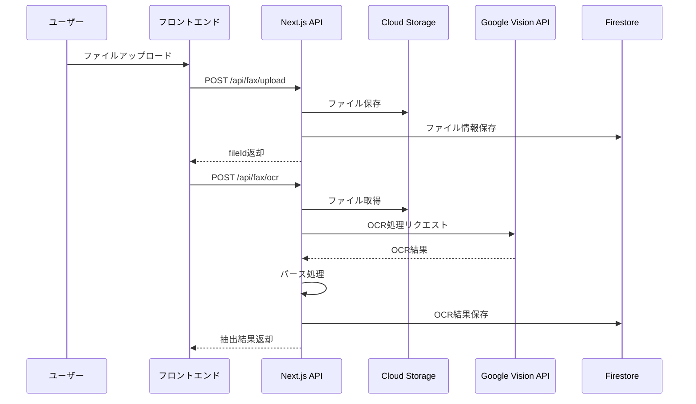
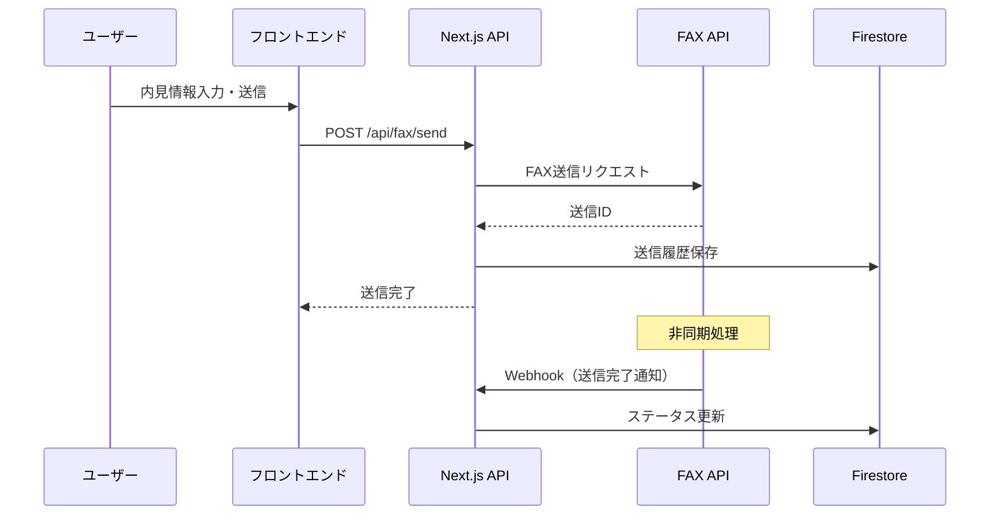
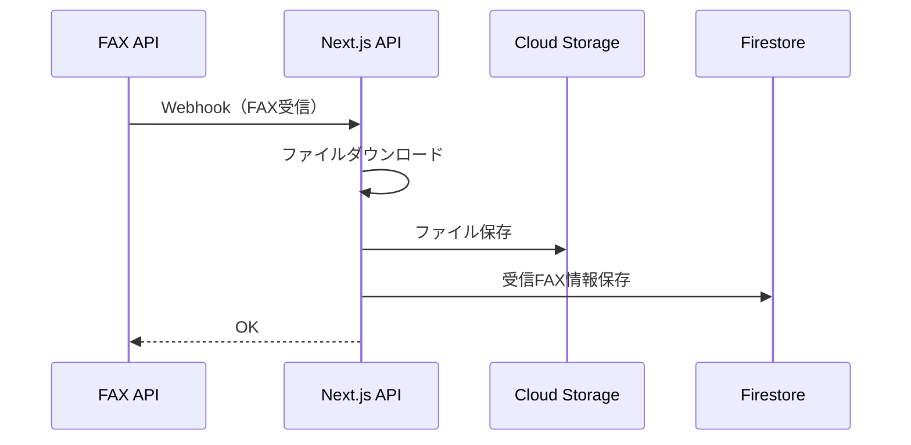

# 不動産業界特化インターネットFAXアプリ MVP開発計画

## 1. 技術スタック提案（Firebase中心の軽量構成）

### フロントエンド

- **Next.js 14+** (App Router) - フルスタックフレームワーク
- **TypeScript** - 型安全性
- **React 18+** - UIライブラリ
- **Tailwind CSS** - スタイリング
- **shadcn/ui** - UIコンポーネントライブラリ
- **React Hook Form** - フォーム管理
- **Zod** - バリデーション

### バックエンド（Firebase中心）

- **Next.js API Routes** - バックエンドAPI
- **Firebase Admin SDK** - Firebaseサーバーサイド操作
- **Firebase Authentication** - 認証（メール/パスワード）
- **Cloud Firestore** - NoSQLデータベース
- **Cloud Storage for Firebase** - ファイル保存

### 外部サービス

- **OCR API**: Google Cloud Vision API（Firebase統合容易）
- **FAX API**: Twilio Fax API または SendFax API

### 開発ツール

- **React Query** - データフェッチング・キャッシング
- **Zustand**（オプション）- クライアント状態管理
- **Vercel** - デプロイメント

## 2. 必要な画面一覧（簡素化）

### 2.1 認証関連

1. **ログイン画面** (`/login`)
   - メールアドレス・パスワード入力

2. **ユーザー登録画面** (`/register`)
   - メールアドレス・パスワード・名前入力

3. **パスワードリセット画面** (`/reset-password`)
   - メールアドレス入力

### 2.2 FAX送信（内見申請ワークフロー）

4. **内見申請FAX送信画面** (`/fax/send`)
   - マイソクPDF/画像アップロード
   - OCR処理中インジケーター
   - OCR結果表示（管理会社名・FAX番号・物件名）
   - 内見日時選択（シンプルな入力フォーム）
   - 担当者選択
   - 送信ボタン
   - 送信ステータス表示

### 2.3 FAX受信

5. **受信FAX一覧画面** (`/fax/received`)
   - 受信FAXリスト表示
   - 基本的なフィルタ（日付）
   - 検索バー

6. **受信FAX詳細画面** (`/fax/received/[id]`)
   - FAX画像プレビュー
   - ダウンロードボタン

### 2.4 履歴管理

7. **送信履歴画面** (`/fax/history/sent`)
   - 送信履歴一覧（テーブル）
   - 基本的な検索・フィルタ機能

8. **受信履歴画面** (`/fax/history/received`)
   - 受信履歴一覧（テーブル）
   - 基本的な検索機能

### 2.5 アドレス帳

9. **アドレス帳一覧画面** (`/address-book`)
   - 管理会社一覧（テーブル）
   - 検索機能
   - 追加・編集・削除ボタン

### 2.6 共通

10. **ダッシュボード** (`/`)
    - 最近の送受信FAX
    - 基本的な統計情報
    - クイックアクション

11. **レイアウト** (`/layout.tsx`)
    - ナビゲーションバー
    - サイドバー（モバイル対応）

## 3. API一覧（簡素化）

### 3.1 認証API（Firebase Authentication経由）

- `POST /api/auth/register` - ユーザー登録
- `POST /api/auth/login` - ログイン
- `POST /api/auth/logout` - ログアウト
- `POST /api/auth/reset-password` - パスワードリセット

### 3.2 FAX送信API

- `POST /api/fax/upload` - ファイルアップロード
  - リクエスト: `FormData (file)`
  - レスポンス: `{ fileId, url }`
- `POST /api/fax/ocr` - OCR処理
  - リクエスト: `{ fileId }`
  - レスポンス: `{ managementCompany, faxNumber, propertyName }`
- `POST /api/fax/send` - FAX送信
  - リクエスト: `{ fileId, faxNumber, propertyName, viewingDate, viewingTime, agentName }`
  - レスポンス: `{ faxId, status }`
- `GET /api/fax/send/[id]/status` - 送信ステータス確認
  - レスポンス: `{ status, sentAt, error }`

### 3.3 FAX受信API

- `POST /api/fax/webhook/receive` - FAX受信Webhook（外部FAX APIから呼び出し）
  - リクエスト: `{ faxNumber, fromNumber, mediaUrl, timestamp }`
- `GET /api/fax/received` - 受信FAX一覧取得
  - クエリ: `?page=1&limit=20&search=&dateFrom=&dateTo=`
  - レスポンス: `{ items: [], total, page }`
- `GET /api/fax/received/[id]` - 受信FAX詳細取得
  - レスポンス: `{ id, receivedAt, fromNumber, fileUrl }`
- `GET /api/fax/received/[id]/download` - 受信FAXダウンロード

### 3.4 履歴API

- `GET /api/fax/history/sent` - 送信履歴一覧
  - クエリ: `?page=1&limit=20&search=&dateFrom=&dateTo=`
  - レスポンス: `{ items: [], total }`
- `GET /api/fax/history/received` - 受信履歴一覧
  - クエリ: `?page=1&limit=20&search=&dateFrom=&dateTo=`
  - レスポンス: `{ items: [], total }`

### 3.5 アドレス帳API

- `GET /api/address-book` - アドレス帳一覧
  - クエリ: `?search=`
  - レスポンス: `{ items: [] }`
- `POST /api/address-book` - 管理会社追加
  - リクエスト: `{ name, faxNumber, notes }`
  - レスポンス: `{ id, ... }`
- `PUT /api/address-book/[id]` - 管理会社更新
- `DELETE /api/address-book/[id]` - 管理会社削除

## 4. Firestoreデータモデル（簡素化）

### 4.1 認証関連

Firebase Authenticationが自動管理。カスタムプロフィール情報は以下：

```javascript
// Firestore Collection: users
{
  uid: string,           // Firebase Auth UID
  email: string,
  name: string,
  createdAt: timestamp,
  updatedAt: timestamp
}
```

### 4.2 FAX送信関連

```javascript
// Firestore Collection: sentFaxes
{
  id: string,
  userId: string,        // Firebase Auth UID
  fileId: string,        // Cloud Storage reference
  faxNumber: string,
  toName: string,
  propertyName: string,
  viewingDate: string,
  viewingTime: string,
  agentName: string,
  status: string,        // pending, processing, sent, failed
  faxProviderId: string, // 外部FAX APIのID
  sentAt: timestamp,
  errorMessage: string,
  createdAt: timestamp
}
```

### 4.3 FAX受信関連

```javascript
// Firestore Collection: receivedFaxes
{
  id: string,
  userId: string,
  fileId: string,        // Cloud Storage reference
  fromFaxNumber: string,
  fromName: string,
  receivedAt: timestamp,
  createdAt: timestamp
}
```

### 4.4 アドレス帳

```javascript
// Firestore Collection: addressBook
{
  id: string,
  userId: string,
  name: string,          // 管理会社名
  faxNumber: string,
  company: string,
  group: string,
  notes: string,
  createdAt: timestamp,
  updatedAt: timestamp
}
```

### 4.5 ファイル管理

```javascript
// Firestore Collection: files
{
  id: string,
  userId: string,
  fileName: string,
  mimeType: string,
  size: number,
  storagePath: string,   // Cloud Storage path
  type: string,          // sent, received
  ocrData: object,       // OCR結果（オプション）
  createdAt: timestamp
}
```

### 4.6 Firebaseセキュリティルール（基本）

```javascript
rules_version = '2';
service cloud.firestore {
  match /databases/{database}/documents {
    // ユーザーは自分のデータのみアクセス可能
    match /users/{userId} {
      allow read, write: if request.auth != null && request.auth.uid == userId;
    }
    
    match /sentFaxes/{faxId} {
      allow read, write: if request.auth != null && 
        resource.data.userId == request.auth.uid;
    }
    
    match /receivedFaxes/{faxId} {
      allow read, write: if request.auth != null && 
        resource.data.userId == request.auth.uid;
    }
    
    match /addressBook/{contactId} {
      allow read, write: if request.auth != null && 
        resource.data.userId == request.auth.uid;
    }
    
    match /files/{fileId} {
      allow read, write: if request.auth != null && 
        resource.data.userId == request.auth.uid;
    }
  }
}
```


## 5. 実装タスクの分解（小規模インクリメンタル）

### Phase 1: 基盤構築（1週間）

#### P0-1: プロジェクトセットアップ
- [ ] Next.js 14プロジェクト初期化（TypeScript）
- [ ] Tailwind CSS設定
- [ ] shadcn/uiインストール・設定
- [ ] ESLint/Prettier設定

#### P0-2: Firebaseセットアップ
- [ ] Firebaseプロジェクト作成
- [ ] Firebase Authentication設定（メール/パスワード）
- [ ] Firestoreデータベース作成
- [ ] セキュリティルール設定
- [ ] Cloud Storageバケット作成
- [ ] 環境変数設定

#### P0-3: 認証機能実装
- [ ] Firebase Auth統合
- [ ] ログイン画面実装
- [ ] ユーザー登録画面実装
- [ ] パスワードリセット機能実装
- [ ] 認証ガード実装

### Phase 2: コア機能（2週間）

#### P1-1: ファイルアップロード
- [ ] ファイルアップロードAPI実装
- [ ] Cloud Storage連携
- [ ] ファイル一覧API実装

#### P1-2: OCR機能実装
- [ ] OCR API連携（Google Cloud Vision）
- [ ] OCR処理API実装
- [ ] OCR結果パース（管理会社名・FAX番号・物件名抽出）

#### P1-3: FAX送信機能（内見申請）
- [ ] 内見申請FAX送信画面UI実装
- [ ] ファイルアップロードUI
- [ ] OCR処理フロー実装
- [ ] 内見日時選択UI
- [ ] FAX送信API実装（外部FAX API連携）
- [ ] 送信ステータス管理

#### P1-4: FAX受信機能
- [ ] FAX受信Webhook実装
- [ ] 受信FAX自動保存（Cloud Storage）
- [ ] 受信FAX一覧画面実装
- [ ] 受信FAX詳細画面実装

### Phase 3: 補助機能（1週間）

#### P2-1: 履歴管理機能
- [ ] 送信履歴一覧画面実装
- [ ] 受信履歴一覧画面実装
- [ ] 基本的な検索・フィルタ機能実装

#### P2-2: アドレス帳機能
- [ ] アドレス帳一覧画面実装
- [ ] 手動登録機能
- [ ] アドレス帳API実装

### Phase 4: UI/UX改善（1週間）

#### P2-3: 共通UI実装
- [ ] レイアウトコンポーネント（ナビバー・サイドバー）
- [ ] ダッシュボード画面実装
- [ ] レスポンシブデザイン対応
- [ ] ローディング状態表示
- [ ] エラーメッセージ表示

#### P2-4: 状態管理・最適化
- [ ] React Query設定（データフェッチング）
- [ ] フォーム状態管理（React Hook Form）
- [ ] バリデーション実装（Zod）

### Phase 5: テスト・デプロイ（数日）

#### P3-1: テスト実装（軽量）
- [ ] 単体テスト（主要な関数のみ）
- [ ] API統合テスト（主要フロー）
- **注**: E2Eテストは省略し、手動テストで代替

#### P3-2: デプロイメント
- [ ] Vercelデプロイ設定
- [ ] 環境変数設定
- [ ] 本番環境テスト

## 6. 技術的考慮事項

### 6.1 OCR処理フロー（簡素化）



### 6.2 FAX送信フロー（簡素化）



### 6.3 FAX受信フロー（簡素化）




## 7. セキュリティ考慮事項

- Firebase Security Rulesによるデータアクセス制御
- 入力値検証・サニタイゼーション
- HTTPS通信（Firebase、Vercel標準）
- ファイルアップロード検証（サイズ、形式）
- Cloud Storageのセキュリティルール設定
- Firebase App Check（DDoS対策）

## 8. Firebase活用のメリット

### 8.1 迅速な開発
- 認証機能がビルトイン
- データベース、ストレージが統合
- リアルタイム同期が標準
- 管理画面が充実

### 8.2 低コスト運用
- インフラ管理不要
- 無料枠が充実（小規模なら無料で運用可能）
- 従量課金で柔軟

### 8.3 スケーラビリティ
- 自動スケーリング
- Googleのインフラ基盤
- グローバル展開容易

## 9. 実装における注意点

### 9.1 Firebase制約
- Firestoreの書き込み制限（1秒に1回/ドキュメント）
- 複雑なクエリは制限される（インデックス活用）
- オフライン対応は追加設定が必要

### 9.2 コスト最適化
- Firestore読み書き回数を最小化
- Cloud Storage転送量を監視
- 不要なリアルタイム監視を避ける

### 9.3 移行性確保
- ビジネスロジックをNext.js側に集約
- Firebase依存部分を抽象化レイヤーで分離

## 10. 開発スケジュール目安

- **Week 1**: 基盤構築（Next.js + Firebase セットアップ、認証）
- **Week 2-3**: コア機能（ファイルアップロード、OCR、FAX送信）
- **Week 4**: コア機能（FAX受信）
- **Week 5**: 補助機能（履歴、アドレス帳）
- **Week 6**: UI/UX改善、レスポンシブ対応
- **Week 7**: テスト、デプロイ

**合計: 約7週間で MVP 完成**