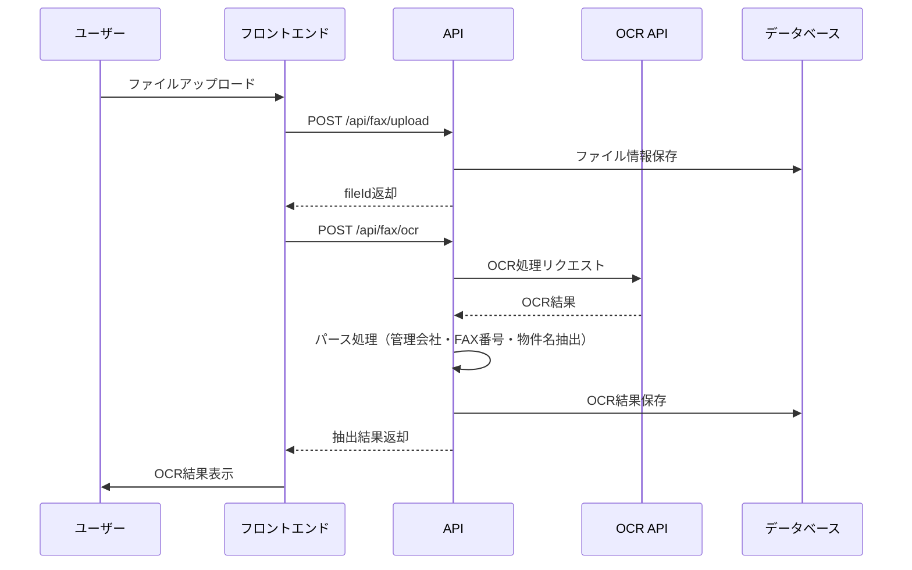
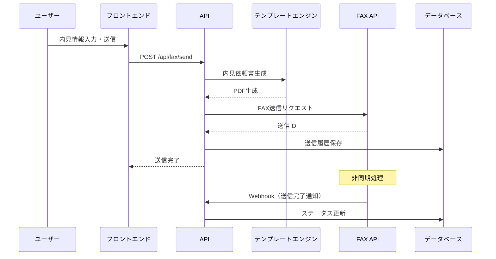
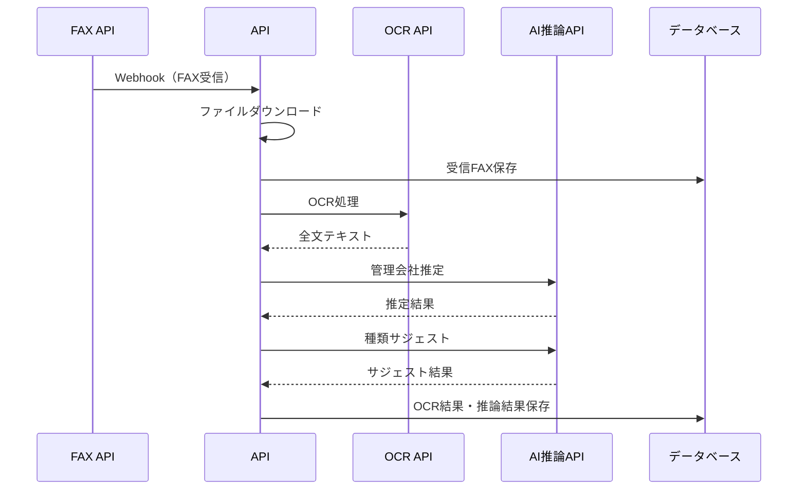

# 不動産業界特化インターネットFAXアプリ MVP開発計画

## 1. 技術スタック提案

### フロントエンド

- **Next.js 14+** (App Router) - フルスタックフレームワーク
- **TypeScript** - 型安全性
- **React 18+** - UIライブラリ
- **Tailwind CSS** - スタイリング
- **shadcn/ui** - UIコンポーネントライブラリ
- **React Hook Form** - フォーム管理
- **Zod** - バリデーション

### バックエンド

- **Next.js API Routes / Server Actions** - バックエンドAPI
- **Supabase** - BaaS（認証、データベース、ストレージ）
- PostgreSQL データベース
- Row Level Security (RLS)
- Storage（ファイル保存）
- Auth（認証）

### 外部サービス

- **OCR API**: Google Cloud Vision API または AWS Textract
- **FAX API**: Twilio Fax API または RingCentral Fax API
- **AI推論**: OpenAI GPT-4 または Claude API（管理会社推定・種類サジェスト用）

### 開発ツール

- **Prisma** - ORM（Supabaseと統合）
- **tRPC**（オプション）- 型安全なAPI
- **Zustand** または **React Query** - 状態管理
- **Vercel** - デプロイメント（推奨）

## 2. 必要な画面一覧

### 2.1 認証関連

1. **ログイン画面** (`/login`)

- メールアドレス・パスワード入力
- パスワードリセットリンク

2. **ユーザー登録画面** (`/register`)

- メールアドレス・パスワード・名前入力

3. **パスワードリセット画面** (`/reset-password`)

- メールアドレス入力
- リセットリンク送信

4. **パスワード再設定画面** (`/reset-password/[token]`)

- 新しいパスワード入力

### 2.2 FAX送信（内見申請ワークフロー）

5. **内見申請FAX送信画面** (`/fax/send`)

- マイソクPDF/画像アップロード
- OCR処理中インジケーター
- OCR結果表示（管理会社名・FAX番号・物件名）
- 内見日時選択（カレンダーUI）
- 担当者選択（ドロップダウン）
- 内見依頼書プレビュー
- 送信ボタン
- 送信ステータス表示

### 2.3 FAX受信

6. **受信FAX一覧画面** (`/fax/received`)

- 受信FAXリスト（グリッド/リスト表示）
- フィルタ（日付、管理会社、種類）
- 検索バー

7. **受信FAX詳細画面** (`/fax/received/[id]`)

- FAX画像プレビュー
- OCR全文テキスト表示
- 推定管理会社表示
- サジェスト種類表示
- ダウンロードボタン

### 2.4 履歴管理

8. **送信履歴画面** (`/fax/history/sent`)

- 送信履歴一覧（テーブル）
- 検索・フィルタ機能
- ステータス表示（送信済み/失敗/処理中）

9. **受信履歴画面** (`/fax/history/received`)

- 受信履歴一覧（テーブル）
- 検索・フィルタ機能
- 管理会社・種類表示

10. **履歴詳細画面** (`/fax/history/[type]/[id]`)

    - 送信/受信の詳細情報
    - 関連ファイル表示

### 2.5 アドレス帳

11. **アドレス帳一覧画面** (`/address-book`)

    - 管理会社一覧（テーブル）
    - 検索機能
    - 追加・編集・削除ボタン

12. **アドレス帳編集画面** (`/address-book/[id]`)

    - 管理会社名・FAX番号・その他情報の編集

### 2.6 ファイル管理

13. **ファイル一覧画面** (`/files`)

    - 送信ファイル・受信FAXの一覧
    - 検索機能
    - ダウンロード・削除

### 2.7 共通

14. **ダッシュボード** (`/`)

    - 最近の送受信FAX
    - 統計情報（送信数、受信数）
    - クイックアクション

15. **レイアウト** (`/layout.tsx`)

    - ナビゲーションバー
    - サイドバー（モバイル対応）
    - フッター

## 3. API一覧

### 3.1 認証API

- `POST /api/auth/register` - ユーザー登録
- `POST /api/auth/login` - ログイン
- `POST /api/auth/logout` - ログアウト
- `POST /api/auth/reset-password` - パスワードリセットリクエスト
- `POST /api/auth/reset-password/[token]` - パスワード再設定

### 3.2 FAX送信API

- `POST /api/fax/send` - FAX送信
- リクエスト: `{ fileId, faxNumber, propertyName, viewingDate, viewingTime, agentName }`
- レスポンス: `{ faxId, status }`
- `POST /api/fax/upload` - ファイルアップロード
- リクエスト: `FormData (file)`
- レスポンス: `{ fileId, url }`
- `POST /api/fax/ocr` - OCR処理
- リクエスト: `{ fileId }`
- レスポンス: `{ managementCompany, faxNumber, propertyName, rawText }`
- `GET /api/fax/send/[id]/status` - 送信ステータス確認
- レスポンス: `{ status, sentAt, error }`
- `GET /api/fax/send/[id]/preview` - 送信プレビュー生成
- レスポンス: `{ previewUrl }`

### 3.3 FAX受信API

- `POST /api/fax/webhook/receive` - FAX受信Webhook（外部FAX APIから呼び出し）
- リクエスト: `{ faxNumber, fromNumber, mediaUrl, timestamp }`
- `GET /api/fax/received` - 受信FAX一覧取得
- クエリ: `?page=1&limit=20&search=&dateFrom=&dateTo=&companyId=`
- レスポンス: `{ items: [], total, page }`
- `GET /api/fax/received/[id]` - 受信FAX詳細取得
- レスポンス: `{ id, receivedAt, fromNumber, managementCompany, suggestedType, ocrText, fileUrl }`
- `POST /api/fax/received/[id]/ocr` - OCR処理（再処理）
- レスポンス: `{ ocrText, managementCompany, suggestedType }`
- `GET /api/fax/received/[id]/download` - 受信FAXダウンロード

### 3.4 履歴API

- `GET /api/fax/history/sent` - 送信履歴一覧
- クエリ: `?page=1&limit=20&search=&dateFrom=&dateTo=&status=`
- レスポンス: `{ items: [], total }`
- `GET /api/fax/history/received` - 受信履歴一覧
- クエリ: `?page=1&limit=20&search=&dateFrom=&dateTo=&companyId=&type=`
- レスポンス: `{ items: [], total }`
- `GET /api/fax/history/[type]/[id]` - 履歴詳細

### 3.5 アドレス帳API

- `GET /api/address-book` - アドレス帳一覧
- クエリ: `?search=`
- レスポンス: `{ items: [] }`
- `POST /api/address-book` - 管理会社追加
- リクエスト: `{ name, faxNumber, notes }`
- レスポンス: `{ id, ... }`
- `PUT /api/address-book/[id]` - 管理会社更新
- `DELETE /api/address-book/[id]` - 管理会社削除
- `POST /api/address-book/auto-register` - OCR結果から自動登録
- リクエスト: `{ name, faxNumber }`

### 3.6 ファイル管理API

- `GET /api/files` - ファイル一覧
- クエリ: `?page=1&limit=20&search=&type=`
- レスポンス: `{ items: [], total }`
- `GET /api/files/[id]` - ファイル詳細
- `GET /api/files/[id]/download` - ファイルダウンロード
- `DELETE /api/files/[id]` - ファイル削除

### 3.7 AI推論API（内部）

- `POST /api/ai/infer-company` - 管理会社推定
- リクエスト: `{ faxNumber, ocrText }`
- レスポンス: `{ companyId, confidence, companyName }`
- `POST /api/ai/suggest-type` - FAX種類サジェスト
- リクエスト: `{ ocrText, faxNumber }`
- レスポンス: `{ type, confidence, reasons: [] }`

## 4. DBテーブル一覧

### 4.1 認証関連

```sql
-- Supabase Authを使用（usersテーブルは自動生成）
-- カスタムプロフィール情報
profiles (
  id UUID PRIMARY KEY REFERENCES auth.users(id),
  name TEXT NOT NULL,
  email TEXT UNIQUE NOT NULL,
  created_at TIMESTAMPTZ DEFAULT NOW(),
  updated_at TIMESTAMPTZ DEFAULT NOW()
)
```


### 4.2 FAX送信関連

```sql
-- 送信FAX
sent_faxes (
  id UUID PRIMARY KEY DEFAULT gen_random_uuid(),
  user_id UUID NOT NULL REFERENCES profiles(id),
  file_id UUID NOT NULL REFERENCES files(id),
  fax_number TEXT NOT NULL,
  management_company_id UUID REFERENCES address_book(id),
  property_name TEXT,
  viewing_date DATE,
  viewing_time TIME,
  agent_name TEXT,
  status TEXT NOT NULL DEFAULT 'pending', -- pending, processing, sent, failed
  fax_provider_id TEXT, -- 外部FAX APIのID
  sent_at TIMESTAMPTZ,
  error_message TEXT,
  created_at TIMESTAMPTZ DEFAULT NOW(),
  updated_at TIMESTAMPTZ DEFAULT NOW()
)

-- 内見依頼書テンプレート（固定1種類）
viewing_request_templates (
  id UUID PRIMARY KEY DEFAULT gen_random_uuid(),
  name TEXT NOT NULL DEFAULT '内見依頼書',
  content TEXT NOT NULL, -- テンプレート内容
  created_at TIMESTAMPTZ DEFAULT NOW(),
  updated_at TIMESTAMPTZ DEFAULT NOW()
)
```


### 4.3 FAX受信関連

```sql
-- 受信FAX
received_faxes (
  id UUID PRIMARY KEY DEFAULT gen_random_uuid(),
  user_id UUID NOT NULL REFERENCES profiles(id),
  file_id UUID NOT NULL REFERENCES files(id),
  from_fax_number TEXT NOT NULL,
  management_company_id UUID REFERENCES address_book(id),
  suggested_type TEXT, -- 内見回答, 申込書, 解約通知, その他
  ocr_text TEXT, -- OCR全文テキスト
  ocr_processed_at TIMESTAMPTZ,
  received_at TIMESTAMPTZ DEFAULT NOW(),
  created_at TIMESTAMPTZ DEFAULT NOW()
)
```


### 4.4 アドレス帳

```sql
-- 管理会社アドレス帳
address_book (
  id UUID PRIMARY KEY DEFAULT gen_random_uuid(),
  user_id UUID NOT NULL REFERENCES profiles(id),
  name TEXT NOT NULL, -- 管理会社名
  fax_number TEXT NOT NULL,
  notes TEXT,
  auto_registered BOOLEAN DEFAULT FALSE, -- OCRから自動登録されたか
  created_at TIMESTAMPTZ DEFAULT NOW(),
  updated_at TIMESTAMPTZ DEFAULT NOW(),
  UNIQUE(user_id, fax_number)
)
```


### 4.5 ファイル管理

```sql
-- ファイル
files (
  id UUID PRIMARY KEY DEFAULT gen_random_uuid(),
  user_id UUID NOT NULL REFERENCES profiles(id),
  name TEXT NOT NULL,
  type TEXT NOT NULL, -- sent, received
  mime_type TEXT,
  size BIGINT,
  storage_path TEXT NOT NULL, -- Supabase Storage path
  ocr_data JSONB, -- OCR結果の生データ
  created_at TIMESTAMPTZ DEFAULT NOW()
)
```


### 4.6 インデックス

```sql
-- パフォーマンス最適化用インデックス
CREATE INDEX idx_sent_faxes_user_id ON sent_faxes(user_id);
CREATE INDEX idx_sent_faxes_status ON sent_faxes(status);
CREATE INDEX idx_sent_faxes_created_at ON sent_faxes(created_at DESC);
CREATE INDEX idx_received_faxes_user_id ON received_faxes(user_id);
CREATE INDEX idx_received_faxes_received_at ON received_faxes(received_at DESC);
CREATE INDEX idx_received_faxes_company_id ON received_faxes(management_company_id);
CREATE INDEX idx_address_book_user_id ON address_book(user_id);
CREATE INDEX idx_address_book_fax_number ON address_book(fax_number);
CREATE INDEX idx_files_user_id ON files(user_id);
CREATE INDEX idx_files_type ON files(type);
```


## 5. 実装タスクの分解（優先度つき）

### Phase 1: 基盤構築（最優先）

#### P0-1: プロジェクトセットアップ

- [ ] Next.js 14プロジェクト初期化（TypeScript）
- [ ] Tailwind CSS設定
- [ ] shadcn/uiインストール・設定
- [ ] ESLint/Prettier設定
- [ ] Gitリポジトリ初期化

#### P0-2: Supabaseセットアップ

- [ ] Supabaseプロジェクト作成
- [ ] データベーススキーマ作成（全テーブル）
- [ ] Row Level Security (RLS) ポリシー設定
- [ ] Storageバケット作成（files）
- [ ] 環境変数設定

#### P0-3: 認証機能実装

- [ ] Supabase Auth設定
- [ ] ログイン画面実装
- [ ] ユーザー登録画面実装
- [ ] パスワードリセット機能実装
- [ ] セッション管理（ミドルウェア）
- [ ] 認証ガード実装

### Phase 2: コア機能（高優先度）

#### P1-1: ファイルアップロード・管理

- [ ] ファイルアップロードAPI実装
- [ ] Supabase Storage連携
- [ ] ファイル一覧API実装
- [ ] ファイルダウンロードAPI実装

#### P1-2: OCR機能実装

- [ ] OCR API連携（Google Cloud Vision / AWS Textract）
- [ ] OCR処理API実装
- [ ] OCR結果パース（管理会社名・FAX番号・物件名抽出）
- [ ] エラーハンドリング

#### P1-3: FAX送信機能（内見申請ワークフロー）

- [ ] 内見申請FAX送信画面UI実装
- [ ] ファイルアップロードUI
- [ ] OCR処理フロー実装
- [ ] 内見日時選択UI（カレンダー）
- [ ] 担当者選択UI
- [ ] 内見依頼書テンプレート実装
- [ ] プレビュー生成機能
- [ ] FAX送信API実装（外部FAX API連携）
- [ ] 送信ステータス管理
- [ ] 送信履歴保存

#### P1-4: FAX受信機能

- [ ] FAX受信Webhook実装
- [ ] 受信FAX自動保存
- [ ] 受信FAX一覧画面実装
- [ ] 受信FAX詳細画面実装
- [ ] 受信時の自動OCR処理
- [ ] 管理会社推定機能（AI推論）
- [ ] FAX種類サジェスト機能（AI推論）

### Phase 3: 補助機能（中優先度）

#### P2-1: 履歴管理機能

- [ ] 送信履歴一覧画面実装
- [ ] 受信履歴一覧画面実装
- [ ] 履歴詳細画面実装
- [ ] 検索・フィルタ機能実装
- [ ] 履歴API実装

#### P2-2: アドレス帳機能

- [ ] アドレス帳一覧画面実装
- [ ] アドレス帳編集画面実装
- [ ] 手動登録機能
- [ ] OCR結果からの自動登録機能
- [ ] アドレス帳API実装

#### P2-3: ファイル管理機能

- [ ] ファイル一覧画面実装
- [ ] ファイル検索機能
- [ ] ファイル削除機能

### Phase 4: UI/UX改善（中優先度）

#### P2-4: 共通UI実装

- [ ] レイアウトコンポーネント（ナビバー・サイドバー）
- [ ] ダッシュボード画面実装
- [ ] レスポンシブデザイン対応
- [ ] ローディング状態表示
- [ ] エラーメッセージ表示

#### P2-5: 状態管理・最適化

- [ ] React Query設定（データフェッチング）
- [ ] フォーム状態管理（React Hook Form）
- [ ] バリデーション実装（Zod）

### Phase 5: テスト・デプロイ（低優先度・後回し可）

#### P3-1: テスト実装

- [ ] 単体テスト（主要関数）
- [ ] API統合テスト
- [ ] E2Eテスト（主要フロー）

#### P3-2: デプロイメント

- [ ] Vercelデプロイ設定
- [ ] 環境変数設定
- [ ] 本番環境テスト
- [ ] エラーログ監視設定

## 6. 技術的考慮事項

### 6.1 OCR処理フロー




### 6.2 FAX送信フロー




### 6.3 FAX受信・AI推論フロー




## 7. セキュリティ考慮事項

- Row Level Security (RLS) でユーザー間データ分離